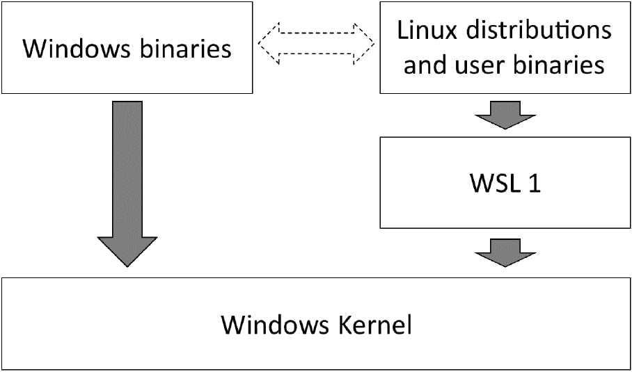
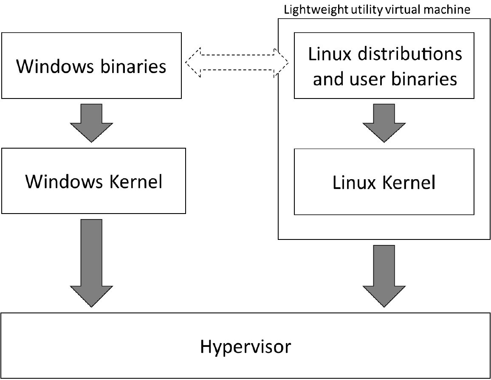

# Ch01 Introduction to the Windows Subsystem for Linux

> **WSL1 vs WSL2**
>
> WSL1 通过一个翻译层（translation layer）实现 Linux 与 Windows 的通信，同时还开辟了 Windows 与 WSL 的文件访问；但为了弥合 Windows 与 Linux 的差异，也可能引入新的资源开销（如大量跨系统文件访问、跨系统重命名已打开文件等）
>
> WSL2 通过运行一个轻量级的 Linux 内核，避免了 WSL 1 中的翻译层。该虚拟机启动迅速，消耗内存更少。在运行需要内存的进程时，会按需动态增加内存。这使得 WSL 2 的性能和系统调用兼容性都得到了大幅提升。
>
> 但 WSL2 也有自身的局限：暂不支持 GPU 和 USB 访问。此外，WSL 2 将通过与主机（拥有独立 IP 地址）不同的网络适配器连接到网络。

二者区别的示意图如下：

WSL1：引入翻译层

WSL2：引入轻量级虚拟机：

WSL2 整合了 Windows 和 Linux 的文件系统和进程，在大多数情况下，在性能和兼容性的表现都由于 WSL 1
