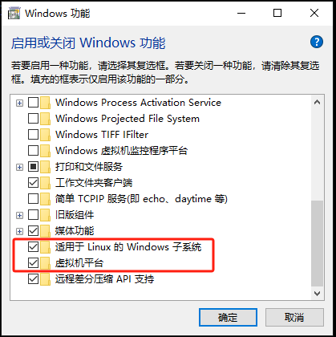

# Ch02 Installing and Configuring the Windows Subsystem for Linux


## 1 安装 WSL：

```bash
# 打开启动或关闭 Windows 功能
【Win】--> 输入 windows features 进入
# 开启虚拟机和 WSL 选项
```



```bash
# 重启计算机
# 打开微软商店（Microsoft Store），安装 Ubuntu 应用
# 启动 Ubuntu，输入 UNIX 用户名和密码（不必与 Windows 一致）
# 设置 WSL 默认版本为 WSL2
> wsl --set-default-version 2
# get a list of the Linux distros
> wsl --list
# see the distros that are running
> wsl --list --running
# list root folder on Linux
> wsl ls ~
learn-awk  shell-scripting  tcl8.6.1-src.tar.gz
# 查看 WSL 中正在运行的 Linux 发行版的版本信息
> wsl cat /etc/issue
Ubuntu 20.04.3 LTS \n \l
# （若有多个发行版）用 -d 手动指定发行版
> wsl -d Ubuntu-20.04 cat /etc/issue
Ubuntu 20.04.3 LTS \n \l
# 停止正在运行的指定的发行版
> wsl --terminate Ubuntu-20.04
# 关闭 WSL 和所有正在运行的发行版
> wsl --shutdown
```


> 实测 `wsl ls ~` 排错：[WSL Error-Processing fstab with mount -a failed](https://superuser.com/questions/1760513/wsl-error-processing-fstab-with-mount-a-failed)
>
> 解决方案：
>
> ```bash
> # windows:
> > wsl --list
> # Ubuntu-20.04
> # ...
> > wsl --set-default Ubuntu-20.04
> # restart windows terminal & retry
> > wsl ls ~
> # (Running well)
> ```


## 2 WSL 配置

|       配置文件       |                路径                 |
| :------------------: | :---------------------------------: |
|  `wsl.conf`（本地）  |       Linux：`/etc/wsl.conf`        |
| `.wslconfig`（全局） | Windows：`%UserProfile%/.wslconfig` |

配置文件格式为 `.ini`：

```ini
[section1]
value1 = true
value2 = "some content"
# This is just a comment
[section2]
value1 = true
```

例如：

```ini
[automount]
enabled = true # control host drive mounting (e.g. /mnt/c)
mountFsTab = true # process /etc/fstab for additional mounts
root = /mnt/ # control where drives are mounted
[interop]
enabled = true # allow WSL to launch Windows processes
appendWindowsPath = true # add Windows PATH to $PATH in WSL
```

其中：

- `automount`：用于控制 WSL 挂载 Windows 驱动器的相关配置
  - `enable`：是否启用自动挂载
  - `root`：设置在 WSL 文件系统中创建驱动器挂载的位置（默认 `/mnt/`）
- `interop`：设置 Linux 发行版与 Windows 交互的相关功能
  - `enabled`：交互开关
  - `appendWindowsPath`：默认情况下，Windows 的 `PATH` 会附加到 Linux 的 `PATH` 上；若需更精细控制哪些 Windows 应用程序会被发现，则可以使用 `appendWindowsPath` 禁用该默认配置。

具体配置含义参考 [官网](https://learn.microsoft.com/en-us/windows/wsl/wsl-config#configure-per-distro-launch-settings-with-wslconf)。


`.wslconfig` 也是 `ini` 格式，例如：

```ini
[wsl2]
memory=4GB
processors=2
localhostForwarding=true
swap=6GB
swapFile=D:\\Temp\\WslSwap.vhdx
```

其中：

- `memory`：表示 WSL2 虚拟机占用的内存限制，默认情况下为系统内存的 80%
- `processors`：表示虚拟机使用的处理器数量限制
- `swapFile`：交换文件的存放路径，注意分隔符必须是 `\\`

具体配置详见微软 [官网](https://docs.microsoft.com/en-us/windows/wsl/wsl-config#configure-global-options-with-wslconfig)